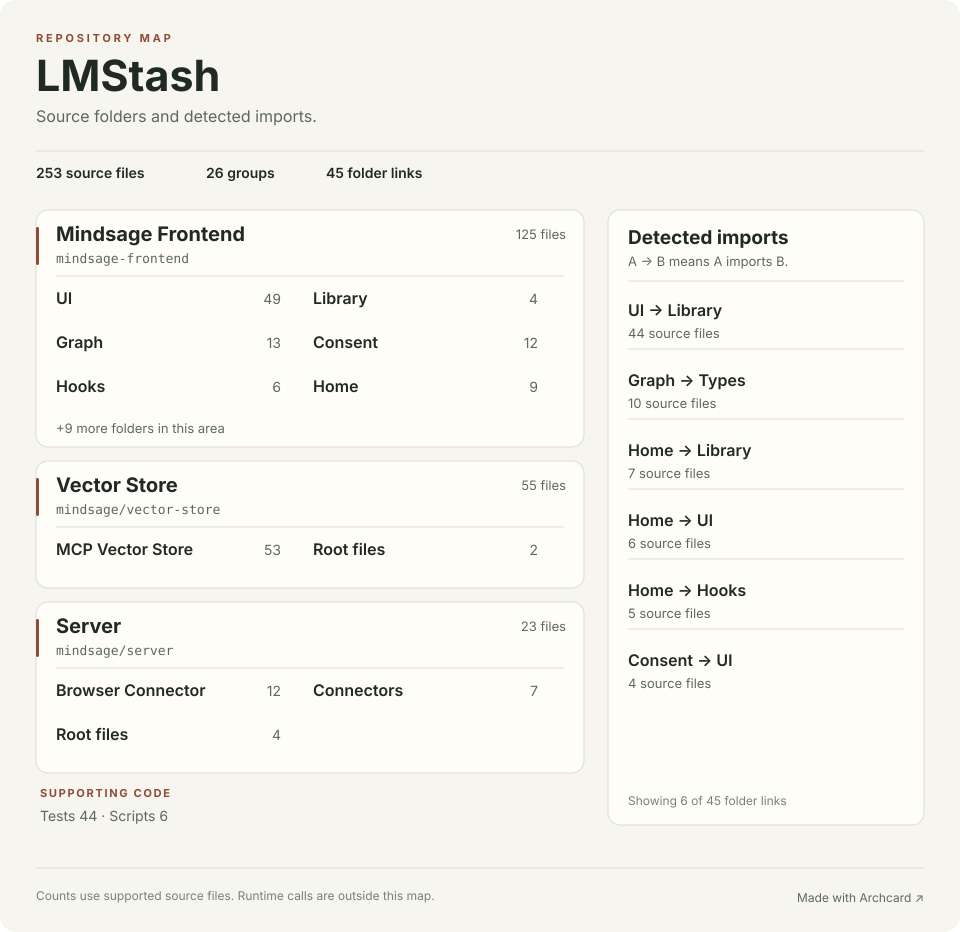

# LMStash source map

This map comes from source files. An arrow means that one local file imports another. It does not show runtime calls, network traffic, or deployments.

253 source files · 27 groups · 450 direct local file imports

## Folder imports

Each count is the number of source files in the first folder that import from the second folder.

| From | Imports | Source files |
| --- | --- | ---: |
| mindsage-frontend/src/components/ui | mindsage-frontend/src/lib | 44 |
| mindsage/vector-store/tests | mindsage/vector-store/mcp_vector_store | 12 |
| mindsage-frontend/src/components/graph | mindsage-frontend/src/types | 10 |
| mindsage-frontend/src/components/home | mindsage-frontend/src/lib | 7 |
| mindsage-frontend/src/components/home | mindsage-frontend/src/components/ui | 6 |
| mindsage-frontend/src/components/home | mindsage-frontend/src/hooks | 5 |
| mindsage-frontend/src/components/consent | mindsage-frontend/src/components/ui | 4 |
| mindsage-frontend/src/components/graph | mindsage-frontend/src/lib | 4 |
| mindsage-frontend/src/components | mindsage-frontend/src/lib | 3 |
| mindsage-frontend/src/components/chat | mindsage-frontend/src/components/ui | 3 |
| mindsage-frontend/src/components/chat | mindsage-frontend/src/lib | 3 |
| mindsage-frontend/src/components/ui | mindsage-frontend/src/hooks | 3 |
| mindsage-frontend/src/hooks | mindsage-frontend/src/lib | 3 |
| mindsage/server/connectors | mindsage/server | 3 |
| mindsage-frontend/src/components | mindsage-frontend/src/components/ui | 2 |
| mindsage-frontend/src/components/chat | mindsage-frontend/src/hooks | 2 |
| mindsage-frontend/src/components/explore | mindsage-frontend/src/components/ui | 2 |
| mindsage-frontend/src/components/explore | mindsage-frontend/src/types | 2 |
| mindsage-frontend/src/components/graph | mindsage-frontend/src/components/ui | 2 |
| mindsage-frontend/src/components/home | mindsage-frontend/src/components/icons | 2 |
| mindsage-frontend/src/pages | mindsage-frontend/src/components/layout | 2 |
| mindsage-frontend/src/pages | mindsage-frontend/src/components/ui | 2 |
| mindsage-frontend/src | mindsage-frontend/src/components | 1 |
| mindsage-frontend/src | mindsage-frontend/src/components/layout | 1 |
| mindsage-frontend/src | mindsage-frontend/src/components/ui | 1 |
| mindsage-frontend/src | mindsage-frontend/src/pages | 1 |
| mindsage-frontend/src/components/chat | mindsage-frontend/src/components/consent | 1 |
| mindsage-frontend/src/components/consent | mindsage-frontend/src/hooks | 1 |
| mindsage-frontend/src/components/consent | mindsage-frontend/src/lib | 1 |
| mindsage-frontend/src/components/explore | mindsage-frontend/src/components/graph | 1 |
| mindsage-frontend/src/components/explore | mindsage-frontend/src/lib | 1 |
| mindsage-frontend/src/components/graph | mindsage-frontend/src/components | 1 |
| mindsage-frontend/src/components/graph | mindsage-frontend/src/components/explore | 1 |
| mindsage-frontend/src/components/home | mindsage-frontend/src/types | 1 |
| mindsage-frontend/src/components/layout | mindsage-frontend/src/components | 1 |
| mindsage-frontend/src/components/layout | mindsage-frontend/src/components/ui | 1 |
| mindsage-frontend/src/components/layout | mindsage-frontend/src/lib | 1 |
| mindsage-frontend/src/hooks | mindsage-frontend/src/components/ui | 1 |
| mindsage-frontend/src/lib | mindsage-frontend/src/types | 1 |
| mindsage-frontend/src/pages | mindsage-frontend/src/components/chat | 1 |
| mindsage-frontend/src/pages | mindsage-frontend/src/components/graph | 1 |
| mindsage-frontend/src/pages | mindsage-frontend/src/components/home | 1 |
| mindsage-frontend/src/pages | mindsage-frontend/src/lib | 1 |
| mindsage/server | mindsage/server/browser-connector | 1 |
| mindsage/server | mindsage/server/connectors | 1 |
| mindsage/server/browser-connector | mindsage/server | 1 |

## Source files

### mindsage-frontend

#### mindsage-frontend/src/components/ui

49 files · TypeScript

| File | Direct local imports |
| --- | --- |
| [accordion.tsx](../mindsage-frontend/src/components/ui/accordion.tsx) | [lib/utils.ts](../mindsage-frontend/src/lib/utils.ts) |
| [alert-dialog.tsx](../mindsage-frontend/src/components/ui/alert-dialog.tsx) | [button.tsx](../mindsage-frontend/src/components/ui/button.tsx), [lib/utils.ts](../mindsage-frontend/src/lib/utils.ts) |
| [alert.tsx](../mindsage-frontend/src/components/ui/alert.tsx) | [lib/utils.ts](../mindsage-frontend/src/lib/utils.ts) |
| [aspect-ratio.tsx](../mindsage-frontend/src/components/ui/aspect-ratio.tsx) | — |
| [avatar.tsx](../mindsage-frontend/src/components/ui/avatar.tsx) | [lib/utils.ts](../mindsage-frontend/src/lib/utils.ts) |
| [badge.tsx](../mindsage-frontend/src/components/ui/badge.tsx) | [lib/utils.ts](../mindsage-frontend/src/lib/utils.ts) |
| [breadcrumb.tsx](../mindsage-frontend/src/components/ui/breadcrumb.tsx) | [lib/utils.ts](../mindsage-frontend/src/lib/utils.ts) |
| [button.tsx](../mindsage-frontend/src/components/ui/button.tsx) | [lib/utils.ts](../mindsage-frontend/src/lib/utils.ts) |
| [calendar.tsx](../mindsage-frontend/src/components/ui/calendar.tsx) | [button.tsx](../mindsage-frontend/src/components/ui/button.tsx), [lib/utils.ts](../mindsage-frontend/src/lib/utils.ts) |
| [card.tsx](../mindsage-frontend/src/components/ui/card.tsx) | [lib/utils.ts](../mindsage-frontend/src/lib/utils.ts) |
| [carousel.tsx](../mindsage-frontend/src/components/ui/carousel.tsx) | [button.tsx](../mindsage-frontend/src/components/ui/button.tsx), [lib/utils.ts](../mindsage-frontend/src/lib/utils.ts) |
| [chart.tsx](../mindsage-frontend/src/components/ui/chart.tsx) | [lib/utils.ts](../mindsage-frontend/src/lib/utils.ts) |
| [checkbox.tsx](../mindsage-frontend/src/components/ui/checkbox.tsx) | [lib/utils.ts](../mindsage-frontend/src/lib/utils.ts) |
| [collapsible.tsx](../mindsage-frontend/src/components/ui/collapsible.tsx) | — |
| [command.tsx](../mindsage-frontend/src/components/ui/command.tsx) | [dialog.tsx](../mindsage-frontend/src/components/ui/dialog.tsx), [lib/utils.ts](../mindsage-frontend/src/lib/utils.ts) |
| [context-menu.tsx](../mindsage-frontend/src/components/ui/context-menu.tsx) | [lib/utils.ts](../mindsage-frontend/src/lib/utils.ts) |
| [dialog.tsx](../mindsage-frontend/src/components/ui/dialog.tsx) | [lib/utils.ts](../mindsage-frontend/src/lib/utils.ts) |
| [drawer.tsx](../mindsage-frontend/src/components/ui/drawer.tsx) | [lib/utils.ts](../mindsage-frontend/src/lib/utils.ts) |
| [dropdown-menu.tsx](../mindsage-frontend/src/components/ui/dropdown-menu.tsx) | [lib/utils.ts](../mindsage-frontend/src/lib/utils.ts) |
| [form.tsx](../mindsage-frontend/src/components/ui/form.tsx) | [label.tsx](../mindsage-frontend/src/components/ui/label.tsx), [lib/utils.ts](../mindsage-frontend/src/lib/utils.ts) |
| [hover-card.tsx](../mindsage-frontend/src/components/ui/hover-card.tsx) | [lib/utils.ts](../mindsage-frontend/src/lib/utils.ts) |
| [input-otp.tsx](../mindsage-frontend/src/components/ui/input-otp.tsx) | [lib/utils.ts](../mindsage-frontend/src/lib/utils.ts) |
| [input.tsx](../mindsage-frontend/src/components/ui/input.tsx) | [lib/utils.ts](../mindsage-frontend/src/lib/utils.ts) |
| [label.tsx](../mindsage-frontend/src/components/ui/label.tsx) | [lib/utils.ts](../mindsage-frontend/src/lib/utils.ts) |
| [menubar.tsx](../mindsage-frontend/src/components/ui/menubar.tsx) | [lib/utils.ts](../mindsage-frontend/src/lib/utils.ts) |
| [navigation-menu.tsx](../mindsage-frontend/src/components/ui/navigation-menu.tsx) | [lib/utils.ts](../mindsage-frontend/src/lib/utils.ts) |
| [pagination.tsx](../mindsage-frontend/src/components/ui/pagination.tsx) | [button.tsx](../mindsage-frontend/src/components/ui/button.tsx), [lib/utils.ts](../mindsage-frontend/src/lib/utils.ts) |
| [popover.tsx](../mindsage-frontend/src/components/ui/popover.tsx) | [lib/utils.ts](../mindsage-frontend/src/lib/utils.ts) |
| [progress.tsx](../mindsage-frontend/src/components/ui/progress.tsx) | [lib/utils.ts](../mindsage-frontend/src/lib/utils.ts) |
| [radio-group.tsx](../mindsage-frontend/src/components/ui/radio-group.tsx) | [lib/utils.ts](../mindsage-frontend/src/lib/utils.ts) |
| [resizable.tsx](../mindsage-frontend/src/components/ui/resizable.tsx) | [lib/utils.ts](../mindsage-frontend/src/lib/utils.ts) |
| [scroll-area.tsx](../mindsage-frontend/src/components/ui/scroll-area.tsx) | [lib/utils.ts](../mindsage-frontend/src/lib/utils.ts) |
| [select.tsx](../mindsage-frontend/src/components/ui/select.tsx) | [lib/utils.ts](../mindsage-frontend/src/lib/utils.ts) |
| [separator.tsx](../mindsage-frontend/src/components/ui/separator.tsx) | [lib/utils.ts](../mindsage-frontend/src/lib/utils.ts) |
| [sheet.tsx](../mindsage-frontend/src/components/ui/sheet.tsx) | [lib/utils.ts](../mindsage-frontend/src/lib/utils.ts) |
| [sidebar.tsx](../mindsage-frontend/src/components/ui/sidebar.tsx) | [button.tsx](../mindsage-frontend/src/components/ui/button.tsx), [input.tsx](../mindsage-frontend/src/components/ui/input.tsx), [separator.tsx](../mindsage-frontend/src/components/ui/separator.tsx), [sheet.tsx](../mindsage-frontend/src/components/ui/sheet.tsx), [skeleton.tsx](../mindsage-frontend/src/components/ui/skeleton.tsx), [tooltip.tsx](../mindsage-frontend/src/components/ui/tooltip.tsx), [hooks/use-mobile.tsx](../mindsage-frontend/src/hooks/use-mobile.tsx), [lib/utils.ts](../mindsage-frontend/src/lib/utils.ts) |
| [skeleton.tsx](../mindsage-frontend/src/components/ui/skeleton.tsx) | [lib/utils.ts](../mindsage-frontend/src/lib/utils.ts) |
| [slider.tsx](../mindsage-frontend/src/components/ui/slider.tsx) | [lib/utils.ts](../mindsage-frontend/src/lib/utils.ts) |
| [sonner.tsx](../mindsage-frontend/src/components/ui/sonner.tsx) | — |
| [switch.tsx](../mindsage-frontend/src/components/ui/switch.tsx) | [lib/utils.ts](../mindsage-frontend/src/lib/utils.ts) |
| [table.tsx](../mindsage-frontend/src/components/ui/table.tsx) | [lib/utils.ts](../mindsage-frontend/src/lib/utils.ts) |
| [tabs.tsx](../mindsage-frontend/src/components/ui/tabs.tsx) | [lib/utils.ts](../mindsage-frontend/src/lib/utils.ts) |
| [textarea.tsx](../mindsage-frontend/src/components/ui/textarea.tsx) | [lib/utils.ts](../mindsage-frontend/src/lib/utils.ts) |
| [toast.tsx](../mindsage-frontend/src/components/ui/toast.tsx) | [lib/utils.ts](../mindsage-frontend/src/lib/utils.ts) |
| [toaster.tsx](../mindsage-frontend/src/components/ui/toaster.tsx) | [toast.tsx](../mindsage-frontend/src/components/ui/toast.tsx), [hooks/use-toast.ts](../mindsage-frontend/src/hooks/use-toast.ts) |
| [toggle-group.tsx](../mindsage-frontend/src/components/ui/toggle-group.tsx) | [toggle.tsx](../mindsage-frontend/src/components/ui/toggle.tsx), [lib/utils.ts](../mindsage-frontend/src/lib/utils.ts) |
| [toggle.tsx](../mindsage-frontend/src/components/ui/toggle.tsx) | [lib/utils.ts](../mindsage-frontend/src/lib/utils.ts) |
| [tooltip.tsx](../mindsage-frontend/src/components/ui/tooltip.tsx) | [lib/utils.ts](../mindsage-frontend/src/lib/utils.ts) |
| [use-toast.ts](../mindsage-frontend/src/components/ui/use-toast.ts) | [hooks/use-toast.ts](../mindsage-frontend/src/hooks/use-toast.ts) |

#### mindsage-frontend/src/components/graph

13 files · TypeScript

| File | Direct local imports |
| --- | --- |
| [CanvasEmptyState.tsx](../mindsage-frontend/src/components/graph/CanvasEmptyState.tsx) | — |
| [FileExplorer.test.tsx](../mindsage-frontend/src/components/graph/FileExplorer.test.tsx) | [FileExplorer.tsx](../mindsage-frontend/src/components/graph/FileExplorer.tsx) |
| [FileExplorer.tsx](../mindsage-frontend/src/components/graph/FileExplorer.tsx) | [canvasStore.ts](../mindsage-frontend/src/components/graph/store/canvasStore.ts), [ui/alert-dialog.tsx](../mindsage-frontend/src/components/ui/alert-dialog.tsx), [ui/button.tsx](../mindsage-frontend/src/components/ui/button.tsx), [ui/context-menu.tsx](../mindsage-frontend/src/components/ui/context-menu.tsx), [ui/dropdown-menu.tsx](../mindsage-frontend/src/components/ui/dropdown-menu.tsx), [ui/input.tsx](../mindsage-frontend/src/components/ui/input.tsx), [lib/api.ts](../mindsage-frontend/src/lib/api.ts), [types/index.ts](../mindsage-frontend/src/types/index.ts) |
| [KnowledgeGraph.tsx](../mindsage-frontend/src/components/graph/KnowledgeGraph.tsx) | [explore/AudioDocumentViewer.tsx](../mindsage-frontend/src/components/explore/AudioDocumentViewer.tsx), [CanvasEmptyState.tsx](../mindsage-frontend/src/components/graph/CanvasEmptyState.tsx), [FileExplorer.tsx](../mindsage-frontend/src/components/graph/FileExplorer.tsx), [MarkdownViewer.tsx](../mindsage-frontend/src/components/graph/MarkdownViewer.tsx), [useManualConnections.ts](../mindsage-frontend/src/components/graph/hooks/useManualConnections.ts), [useSavedViews.ts](../mindsage-frontend/src/components/graph/hooks/useSavedViews.ts), [DocumentCardNode.tsx](../mindsage-frontend/src/components/graph/nodes/DocumentCardNode.tsx), [EntityPillNode.tsx](../mindsage-frontend/src/components/graph/nodes/EntityPillNode.tsx), [TopicBadgeNode.tsx](../mindsage-frontend/src/components/graph/nodes/TopicBadgeNode.tsx), [canvasStore.ts](../mindsage-frontend/src/components/graph/store/canvasStore.ts), [useExpandedNodes.ts](../mindsage-frontend/src/components/graph/useExpandedNodes.ts), [useGraphLayout.ts](../mindsage-frontend/src/components/graph/useGraphLayout.ts), [ui/alert-dialog.tsx](../mindsage-frontend/src/components/ui/alert-dialog.tsx), [ui/badge.tsx](../mindsage-frontend/src/components/ui/badge.tsx), [ui/button.tsx](../mindsage-frontend/src/components/ui/button.tsx), [ui/dialog.tsx](../mindsage-frontend/src/components/ui/dialog.tsx), [ui/dropdown-menu.tsx](../mindsage-frontend/src/components/ui/dropdown-menu.tsx), [ui/input.tsx](../mindsage-frontend/src/components/ui/input.tsx), [ui/label.tsx](../mindsage-frontend/src/components/ui/label.tsx), [ui/scroll-area.tsx](../mindsage-frontend/src/components/ui/scroll-area.tsx), [ui/tabs.tsx](../mindsage-frontend/src/components/ui/tabs.tsx), [ui/textarea.tsx](../mindsage-frontend/src/components/ui/textarea.tsx), [lib/api.ts](../mindsage-frontend/src/lib/api.ts), [types/index.ts](../mindsage-frontend/src/types/index.ts) |
| [MarkdownViewer.tsx](../mindsage-frontend/src/components/graph/MarkdownViewer.tsx) | [components/ThemeProvider.tsx](../mindsage-frontend/src/components/ThemeProvider.tsx), [types/index.ts](../mindsage-frontend/src/types/index.ts) |
| [useManualConnections.ts](../mindsage-frontend/src/components/graph/hooks/useManualConnections.ts) | [lib/api.ts](../mindsage-frontend/src/lib/api.ts) |
| [useSavedViews.ts](../mindsage-frontend/src/components/graph/hooks/useSavedViews.ts) | [canvasStore.ts](../mindsage-frontend/src/components/graph/store/canvasStore.ts), [lib/api.ts](../mindsage-frontend/src/lib/api.ts), [types/index.ts](../mindsage-frontend/src/types/index.ts) |
| [DocumentCardNode.tsx](../mindsage-frontend/src/components/graph/nodes/DocumentCardNode.tsx) | [types/index.ts](../mindsage-frontend/src/types/index.ts) |
| [EntityPillNode.tsx](../mindsage-frontend/src/components/graph/nodes/EntityPillNode.tsx) | [types/index.ts](../mindsage-frontend/src/types/index.ts) |
| [TopicBadgeNode.tsx](../mindsage-frontend/src/components/graph/nodes/TopicBadgeNode.tsx) | [types/index.ts](../mindsage-frontend/src/types/index.ts) |
| [canvasStore.ts](../mindsage-frontend/src/components/graph/store/canvasStore.ts) | [types/index.ts](../mindsage-frontend/src/types/index.ts) |
| [useExpandedNodes.ts](../mindsage-frontend/src/components/graph/useExpandedNodes.ts) | [types/index.ts](../mindsage-frontend/src/types/index.ts) |
| [useGraphLayout.ts](../mindsage-frontend/src/components/graph/useGraphLayout.ts) | [types/index.ts](../mindsage-frontend/src/types/index.ts) |

#### mindsage-frontend/src/components/consent

12 files · TypeScript

| File | Direct local imports |
| --- | --- |
| [CategoryFilter.test.tsx](../mindsage-frontend/src/components/consent/CategoryFilter.test.tsx) | [CategoryFilter.tsx](../mindsage-frontend/src/components/consent/CategoryFilter.tsx) |
| [CategoryFilter.tsx](../mindsage-frontend/src/components/consent/CategoryFilter.tsx) | [types.ts](../mindsage-frontend/src/components/consent/types.ts), [ui/badge.tsx](../mindsage-frontend/src/components/ui/badge.tsx), [ui/switch.tsx](../mindsage-frontend/src/components/ui/switch.tsx) |
| [ConsentBadge.tsx](../mindsage-frontend/src/components/consent/ConsentBadge.tsx) | [types.ts](../mindsage-frontend/src/components/consent/types.ts) |
| [ConsentDialog.test.tsx](../mindsage-frontend/src/components/consent/ConsentDialog.test.tsx) | [ConsentDialog.tsx](../mindsage-frontend/src/components/consent/ConsentDialog.tsx) |
| [ConsentDialog.tsx](../mindsage-frontend/src/components/consent/ConsentDialog.tsx) | [CategoryFilter.tsx](../mindsage-frontend/src/components/consent/CategoryFilter.tsx), [ConsentPresetSelector.tsx](../mindsage-frontend/src/components/consent/ConsentPresetSelector.tsx), [PIITypeFilter.tsx](../mindsage-frontend/src/components/consent/PIITypeFilter.tsx), [types.ts](../mindsage-frontend/src/components/consent/types.ts), [use-consent.ts](../mindsage-frontend/src/components/consent/use-consent.ts), [ui/button.tsx](../mindsage-frontend/src/components/ui/button.tsx), [ui/dialog.tsx](../mindsage-frontend/src/components/ui/dialog.tsx), [ui/tabs.tsx](../mindsage-frontend/src/components/ui/tabs.tsx), [ui/tooltip.tsx](../mindsage-frontend/src/components/ui/tooltip.tsx), [hooks/use-toast.ts](../mindsage-frontend/src/hooks/use-toast.ts), [lib/utils.ts](../mindsage-frontend/src/lib/utils.ts) |
| [ConsentPresetSelector.test.tsx](../mindsage-frontend/src/components/consent/ConsentPresetSelector.test.tsx) | [ConsentPresetSelector.tsx](../mindsage-frontend/src/components/consent/ConsentPresetSelector.tsx) |
| [ConsentPresetSelector.tsx](../mindsage-frontend/src/components/consent/ConsentPresetSelector.tsx) | [types.ts](../mindsage-frontend/src/components/consent/types.ts), [ui/button.tsx](../mindsage-frontend/src/components/ui/button.tsx) |
| [PIITypeFilter.test.tsx](../mindsage-frontend/src/components/consent/PIITypeFilter.test.tsx) | [PIITypeFilter.tsx](../mindsage-frontend/src/components/consent/PIITypeFilter.tsx) |
| [PIITypeFilter.tsx](../mindsage-frontend/src/components/consent/PIITypeFilter.tsx) | [types.ts](../mindsage-frontend/src/components/consent/types.ts), [ui/badge.tsx](../mindsage-frontend/src/components/ui/badge.tsx), [ui/switch.tsx](../mindsage-frontend/src/components/ui/switch.tsx) |
| [index.ts](../mindsage-frontend/src/components/consent/index.ts) | [CategoryFilter.tsx](../mindsage-frontend/src/components/consent/CategoryFilter.tsx), [ConsentBadge.tsx](../mindsage-frontend/src/components/consent/ConsentBadge.tsx), [ConsentDialog.tsx](../mindsage-frontend/src/components/consent/ConsentDialog.tsx), [ConsentPresetSelector.tsx](../mindsage-frontend/src/components/consent/ConsentPresetSelector.tsx), [PIITypeFilter.tsx](../mindsage-frontend/src/components/consent/PIITypeFilter.tsx), [types.ts](../mindsage-frontend/src/components/consent/types.ts), [use-consent.ts](../mindsage-frontend/src/components/consent/use-consent.ts) |
| [types.ts](../mindsage-frontend/src/components/consent/types.ts) | — |
| [use-consent.ts](../mindsage-frontend/src/components/consent/use-consent.ts) | [types.ts](../mindsage-frontend/src/components/consent/types.ts) |

#### mindsage-frontend/src/components/home

9 files · TypeScript

| File | Direct local imports |
| --- | --- |
| [AIConnectorDialog.tsx](../mindsage-frontend/src/components/home/AIConnectorDialog.tsx) | [ui/alert-dialog.tsx](../mindsage-frontend/src/components/ui/alert-dialog.tsx), [ui/badge.tsx](../mindsage-frontend/src/components/ui/badge.tsx), [ui/button.tsx](../mindsage-frontend/src/components/ui/button.tsx), [ui/collapsible.tsx](../mindsage-frontend/src/components/ui/collapsible.tsx), [ui/dialog.tsx](../mindsage-frontend/src/components/ui/dialog.tsx), [ui/label.tsx](../mindsage-frontend/src/components/ui/label.tsx), [ui/scroll-area.tsx](../mindsage-frontend/src/components/ui/scroll-area.tsx), [ui/slider.tsx](../mindsage-frontend/src/components/ui/slider.tsx), [ui/switch.tsx](../mindsage-frontend/src/components/ui/switch.tsx), [hooks/use-toast.ts](../mindsage-frontend/src/hooks/use-toast.ts), [lib/api.ts](../mindsage-frontend/src/lib/api.ts), [lib/utils.ts](../mindsage-frontend/src/lib/utils.ts) |
| [BrowserConnectorPanel.tsx](../mindsage-frontend/src/components/home/BrowserConnectorPanel.tsx) | [ui/alert-dialog.tsx](../mindsage-frontend/src/components/ui/alert-dialog.tsx), [ui/badge.tsx](../mindsage-frontend/src/components/ui/badge.tsx), [ui/button.tsx](../mindsage-frontend/src/components/ui/button.tsx), [ui/card.tsx](../mindsage-frontend/src/components/ui/card.tsx), [ui/collapsible.tsx](../mindsage-frontend/src/components/ui/collapsible.tsx), [ui/dialog.tsx](../mindsage-frontend/src/components/ui/dialog.tsx), [ui/label.tsx](../mindsage-frontend/src/components/ui/label.tsx), [ui/scroll-area.tsx](../mindsage-frontend/src/components/ui/scroll-area.tsx), [ui/select.tsx](../mindsage-frontend/src/components/ui/select.tsx), [ui/switch.tsx](../mindsage-frontend/src/components/ui/switch.tsx), [hooks/use-toast.ts](../mindsage-frontend/src/hooks/use-toast.ts), [lib/api.ts](../mindsage-frontend/src/lib/api.ts), [lib/utils.ts](../mindsage-frontend/src/lib/utils.ts) |
| [ChatGPTConnectorDialog.tsx](../mindsage-frontend/src/components/home/ChatGPTConnectorDialog.tsx) | [icons/ConnectorLogos.tsx](../mindsage-frontend/src/components/icons/ConnectorLogos.tsx), [ui/alert-dialog.tsx](../mindsage-frontend/src/components/ui/alert-dialog.tsx), [ui/badge.tsx](../mindsage-frontend/src/components/ui/badge.tsx), [ui/button.tsx](../mindsage-frontend/src/components/ui/button.tsx), [ui/collapsible.tsx](../mindsage-frontend/src/components/ui/collapsible.tsx), [ui/dialog.tsx](../mindsage-frontend/src/components/ui/dialog.tsx), [ui/label.tsx](../mindsage-frontend/src/components/ui/label.tsx), [ui/scroll-area.tsx](../mindsage-frontend/src/components/ui/scroll-area.tsx), [ui/slider.tsx](../mindsage-frontend/src/components/ui/slider.tsx), [ui/switch.tsx](../mindsage-frontend/src/components/ui/switch.tsx), [hooks/use-toast.ts](../mindsage-frontend/src/hooks/use-toast.ts), [lib/api.ts](../mindsage-frontend/src/lib/api.ts), [lib/utils.ts](../mindsage-frontend/src/lib/utils.ts) |
| [ConnectorGrid.test.tsx](../mindsage-frontend/src/components/home/ConnectorGrid.test.tsx) | [ConnectorGrid.tsx](../mindsage-frontend/src/components/home/ConnectorGrid.tsx) |
| [ConnectorGrid.tsx](../mindsage-frontend/src/components/home/ConnectorGrid.tsx) | [AIConnectorDialog.tsx](../mindsage-frontend/src/components/home/AIConnectorDialog.tsx), [icons/ConnectorLogos.tsx](../mindsage-frontend/src/components/icons/ConnectorLogos.tsx), [ui/alert-dialog.tsx](../mindsage-frontend/src/components/ui/alert-dialog.tsx), [ui/badge.tsx](../mindsage-frontend/src/components/ui/badge.tsx), [ui/button.tsx](../mindsage-frontend/src/components/ui/button.tsx), [ui/card.tsx](../mindsage-frontend/src/components/ui/card.tsx), [ui/dialog.tsx](../mindsage-frontend/src/components/ui/dialog.tsx), [ui/dropdown-menu.tsx](../mindsage-frontend/src/components/ui/dropdown-menu.tsx), [ui/input.tsx](../mindsage-frontend/src/components/ui/input.tsx), [ui/label.tsx](../mindsage-frontend/src/components/ui/label.tsx), [ui/popover.tsx](../mindsage-frontend/src/components/ui/popover.tsx), [hooks/use-toast.ts](../mindsage-frontend/src/hooks/use-toast.ts), [lib/api.ts](../mindsage-frontend/src/lib/api.ts), [types/index.ts](../mindsage-frontend/src/types/index.ts) |
| [FileTransferPanel.test.tsx](../mindsage-frontend/src/components/home/FileTransferPanel.test.tsx) | — |
| [FileTransferPanel.tsx](../mindsage-frontend/src/components/home/FileTransferPanel.tsx) | [ui/badge.tsx](../mindsage-frontend/src/components/ui/badge.tsx), [ui/button.tsx](../mindsage-frontend/src/components/ui/button.tsx), [ui/card.tsx](../mindsage-frontend/src/components/ui/card.tsx), [ui/collapsible.tsx](../mindsage-frontend/src/components/ui/collapsible.tsx), [ui/progress.tsx](../mindsage-frontend/src/components/ui/progress.tsx), [ui/tabs.tsx](../mindsage-frontend/src/components/ui/tabs.tsx), [hooks/use-toast.ts](../mindsage-frontend/src/hooks/use-toast.ts), [lib/api.ts](../mindsage-frontend/src/lib/api.ts) |
| [MCPSetupPanel.test.tsx](../mindsage-frontend/src/components/home/MCPSetupPanel.test.tsx) | [MCPSetupPanel.tsx](../mindsage-frontend/src/components/home/MCPSetupPanel.tsx), [lib/utils.ts](../mindsage-frontend/src/lib/utils.ts) |
| [MCPSetupPanel.tsx](../mindsage-frontend/src/components/home/MCPSetupPanel.tsx) | [ui/badge.tsx](../mindsage-frontend/src/components/ui/badge.tsx), [ui/button.tsx](../mindsage-frontend/src/components/ui/button.tsx), [ui/card.tsx](../mindsage-frontend/src/components/ui/card.tsx), [ui/collapsible.tsx](../mindsage-frontend/src/components/ui/collapsible.tsx), [lib/api.ts](../mindsage-frontend/src/lib/api.ts), [lib/utils.ts](../mindsage-frontend/src/lib/utils.ts) |

#### mindsage-frontend/src/components/chat

7 files · TypeScript

| File | Direct local imports |
| --- | --- |
| [ChatPanel.messages.test.tsx](../mindsage-frontend/src/components/chat/ChatPanel.messages.test.tsx) | [ChatPanel.tsx](../mindsage-frontend/src/components/chat/ChatPanel.tsx) |
| [ChatPanel.test.tsx](../mindsage-frontend/src/components/chat/ChatPanel.test.tsx) | [ChatPanel.tsx](../mindsage-frontend/src/components/chat/ChatPanel.tsx) |
| [ChatPanel.tsx](../mindsage-frontend/src/components/chat/ChatPanel.tsx) | [LLMConfigDialog.tsx](../mindsage-frontend/src/components/chat/LLMConfigDialog.tsx), [SourcesList.tsx](../mindsage-frontend/src/components/chat/SourcesList.tsx), [consent/index.ts](../mindsage-frontend/src/components/consent/index.ts), [ui/alert-dialog.tsx](../mindsage-frontend/src/components/ui/alert-dialog.tsx), [ui/button.tsx](../mindsage-frontend/src/components/ui/button.tsx), [ui/scroll-area.tsx](../mindsage-frontend/src/components/ui/scroll-area.tsx), [ui/textarea.tsx](../mindsage-frontend/src/components/ui/textarea.tsx), [hooks/use-backend-chat.ts](../mindsage-frontend/src/hooks/use-backend-chat.ts), [hooks/use-voice-rtc.ts](../mindsage-frontend/src/hooks/use-voice-rtc.ts) |
| [LLMConfigDialog.test.tsx](../mindsage-frontend/src/components/chat/LLMConfigDialog.test.tsx) | [LLMConfigDialog.tsx](../mindsage-frontend/src/components/chat/LLMConfigDialog.tsx) |
| [LLMConfigDialog.tsx](../mindsage-frontend/src/components/chat/LLMConfigDialog.tsx) | [ui/badge.tsx](../mindsage-frontend/src/components/ui/badge.tsx), [ui/button.tsx](../mindsage-frontend/src/components/ui/button.tsx), [ui/dialog.tsx](../mindsage-frontend/src/components/ui/dialog.tsx), [ui/input.tsx](../mindsage-frontend/src/components/ui/input.tsx), [ui/label.tsx](../mindsage-frontend/src/components/ui/label.tsx), [ui/select.tsx](../mindsage-frontend/src/components/ui/select.tsx), [ui/tabs.tsx](../mindsage-frontend/src/components/ui/tabs.tsx), [ui/tooltip.tsx](../mindsage-frontend/src/components/ui/tooltip.tsx), [hooks/use-toast.ts](../mindsage-frontend/src/hooks/use-toast.ts), [lib/api.ts](../mindsage-frontend/src/lib/api.ts) |
| [SourcesList.test.tsx](../mindsage-frontend/src/components/chat/SourcesList.test.tsx) | [SourcesList.tsx](../mindsage-frontend/src/components/chat/SourcesList.tsx), [lib/api.ts](../mindsage-frontend/src/lib/api.ts) |
| [SourcesList.tsx](../mindsage-frontend/src/components/chat/SourcesList.tsx) | [ui/badge.tsx](../mindsage-frontend/src/components/ui/badge.tsx), [ui/button.tsx](../mindsage-frontend/src/components/ui/button.tsx), [ui/tooltip.tsx](../mindsage-frontend/src/components/ui/tooltip.tsx), [lib/api.ts](../mindsage-frontend/src/lib/api.ts) |

#### mindsage-frontend/src/pages

7 files · TypeScript

| File | Direct local imports |
| --- | --- |
| [Explore.tsx](../mindsage-frontend/src/pages/Explore.tsx) | [graph/KnowledgeGraph.tsx](../mindsage-frontend/src/components/graph/KnowledgeGraph.tsx), [layout/PageContainer.tsx](../mindsage-frontend/src/components/layout/PageContainer.tsx) |
| [Index.test.tsx](../mindsage-frontend/src/pages/Index.test.tsx) | [Index.tsx](../mindsage-frontend/src/pages/Index.tsx) |
| [Index.tsx](../mindsage-frontend/src/pages/Index.tsx) | [chat/ChatPanel.tsx](../mindsage-frontend/src/components/chat/ChatPanel.tsx), [home/ConnectorGrid.tsx](../mindsage-frontend/src/components/home/ConnectorGrid.tsx), [home/FileTransferPanel.tsx](../mindsage-frontend/src/components/home/FileTransferPanel.tsx), [home/MCPSetupPanel.tsx](../mindsage-frontend/src/components/home/MCPSetupPanel.tsx), [layout/PageContainer.tsx](../mindsage-frontend/src/components/layout/PageContainer.tsx) |
| [Landing.test.tsx](../mindsage-frontend/src/pages/Landing.test.tsx) | [Landing.tsx](../mindsage-frontend/src/pages/Landing.tsx) |
| [Landing.tsx](../mindsage-frontend/src/pages/Landing.tsx) | [ui/badge.tsx](../mindsage-frontend/src/components/ui/badge.tsx), [ui/button.tsx](../mindsage-frontend/src/components/ui/button.tsx) |
| [NotFound.tsx](../mindsage-frontend/src/pages/NotFound.tsx) | — |
| [VncViewer.tsx](../mindsage-frontend/src/pages/VncViewer.tsx) | [ui/badge.tsx](../mindsage-frontend/src/components/ui/badge.tsx), [ui/button.tsx](../mindsage-frontend/src/components/ui/button.tsx), [ui/card.tsx](../mindsage-frontend/src/components/ui/card.tsx), [ui/input.tsx](../mindsage-frontend/src/components/ui/input.tsx), [lib/api.ts](../mindsage-frontend/src/lib/api.ts) |

#### mindsage-frontend/src/components

6 files · TypeScript

| File | Direct local imports |
| --- | --- |
| [DebugPanel.tsx](../mindsage-frontend/src/components/DebugPanel.tsx) | [ui/alert-dialog.tsx](../mindsage-frontend/src/components/ui/alert-dialog.tsx), [ui/badge.tsx](../mindsage-frontend/src/components/ui/badge.tsx), [ui/button.tsx](../mindsage-frontend/src/components/ui/button.tsx), [ui/progress.tsx](../mindsage-frontend/src/components/ui/progress.tsx), [lib/api.ts](../mindsage-frontend/src/lib/api.ts) |
| [ErrorBoundary.test.tsx](../mindsage-frontend/src/components/ErrorBoundary.test.tsx) | [ErrorBoundary.tsx](../mindsage-frontend/src/components/ErrorBoundary.tsx) |
| [ErrorBoundary.tsx](../mindsage-frontend/src/components/ErrorBoundary.tsx) | — |
| [ExtractionStatus.tsx](../mindsage-frontend/src/components/ExtractionStatus.tsx) | [ui/tooltip.tsx](../mindsage-frontend/src/components/ui/tooltip.tsx), [lib/api.ts](../mindsage-frontend/src/lib/api.ts), [lib/utils.ts](../mindsage-frontend/src/lib/utils.ts) |
| [NavLink.tsx](../mindsage-frontend/src/components/NavLink.tsx) | [lib/utils.ts](../mindsage-frontend/src/lib/utils.ts) |
| [ThemeProvider.tsx](../mindsage-frontend/src/components/ThemeProvider.tsx) | — |

#### mindsage-frontend/src/hooks

6 files · TypeScript

| File | Direct local imports |
| --- | --- |
| [use-backend-chat.test.ts](../mindsage-frontend/src/hooks/use-backend-chat.test.ts) | [use-backend-chat.ts](../mindsage-frontend/src/hooks/use-backend-chat.ts) |
| [use-backend-chat.ts](../mindsage-frontend/src/hooks/use-backend-chat.ts) | [lib/api.ts](../mindsage-frontend/src/lib/api.ts) |
| [use-mobile.tsx](../mindsage-frontend/src/hooks/use-mobile.tsx) | — |
| [use-toast.ts](../mindsage-frontend/src/hooks/use-toast.ts) | [ui/toast.tsx](../mindsage-frontend/src/components/ui/toast.tsx) |
| [use-voice-rtc.test.ts](../mindsage-frontend/src/hooks/use-voice-rtc.test.ts) | [use-voice-rtc.ts](../mindsage-frontend/src/hooks/use-voice-rtc.ts), [lib/api.ts](../mindsage-frontend/src/lib/api.ts) |
| [use-voice-rtc.ts](../mindsage-frontend/src/hooks/use-voice-rtc.ts) | [lib/api.ts](../mindsage-frontend/src/lib/api.ts) |

#### mindsage-frontend/src

4 files · CSS

| File | Direct local imports |
| --- | --- |
| [App.css](../mindsage-frontend/src/App.css) | — |
| [App.tsx](../mindsage-frontend/src/App.tsx) | [components/DebugPanel.tsx](../mindsage-frontend/src/components/DebugPanel.tsx), [components/ErrorBoundary.tsx](../mindsage-frontend/src/components/ErrorBoundary.tsx), [components/ThemeProvider.tsx](../mindsage-frontend/src/components/ThemeProvider.tsx), [layout/Header.tsx](../mindsage-frontend/src/components/layout/Header.tsx), [ui/sonner.tsx](../mindsage-frontend/src/components/ui/sonner.tsx), [ui/toaster.tsx](../mindsage-frontend/src/components/ui/toaster.tsx), [ui/tooltip.tsx](../mindsage-frontend/src/components/ui/tooltip.tsx), [pages/Explore.tsx](../mindsage-frontend/src/pages/Explore.tsx), [pages/Index.tsx](../mindsage-frontend/src/pages/Index.tsx), [pages/Landing.tsx](../mindsage-frontend/src/pages/Landing.tsx), [pages/NotFound.tsx](../mindsage-frontend/src/pages/NotFound.tsx), [pages/VncViewer.tsx](../mindsage-frontend/src/pages/VncViewer.tsx) |
| [index.css](../mindsage-frontend/src/index.css) | — |
| [main.tsx](../mindsage-frontend/src/main.tsx) | [App.tsx](../mindsage-frontend/src/App.tsx), [index.css](../mindsage-frontend/src/index.css) |

#### mindsage-frontend/src/lib

4 files · TypeScript

| File | Direct local imports |
| --- | --- |
| [api.test.ts](../mindsage-frontend/src/lib/api.test.ts) | [api.ts](../mindsage-frontend/src/lib/api.ts) |
| [api.ts](../mindsage-frontend/src/lib/api.ts) | [types/index.ts](../mindsage-frontend/src/types/index.ts) |
| [utils.test.ts](../mindsage-frontend/src/lib/utils.test.ts) | [utils.ts](../mindsage-frontend/src/lib/utils.ts) |
| [utils.ts](../mindsage-frontend/src/lib/utils.ts) | — |

#### mindsage-frontend/src/components/layout

3 files · TypeScript

| File | Direct local imports |
| --- | --- |
| [Header.test.tsx](../mindsage-frontend/src/components/layout/Header.test.tsx) | [Header.tsx](../mindsage-frontend/src/components/layout/Header.tsx) |
| [Header.tsx](../mindsage-frontend/src/components/layout/Header.tsx) | [components/ExtractionStatus.tsx](../mindsage-frontend/src/components/ExtractionStatus.tsx), [components/ThemeProvider.tsx](../mindsage-frontend/src/components/ThemeProvider.tsx), [ui/button.tsx](../mindsage-frontend/src/components/ui/button.tsx), [ui/dropdown-menu.tsx](../mindsage-frontend/src/components/ui/dropdown-menu.tsx) |
| [PageContainer.tsx](../mindsage-frontend/src/components/layout/PageContainer.tsx) | [lib/utils.ts](../mindsage-frontend/src/lib/utils.ts) |

#### mindsage-frontend/src/components/explore

2 files · TypeScript

| File | Direct local imports |
| --- | --- |
| [AudioDocumentViewer.tsx](../mindsage-frontend/src/components/explore/AudioDocumentViewer.tsx) | [ui/badge.tsx](../mindsage-frontend/src/components/ui/badge.tsx), [ui/button.tsx](../mindsage-frontend/src/components/ui/button.tsx), [ui/scroll-area.tsx](../mindsage-frontend/src/components/ui/scroll-area.tsx), [ui/slider.tsx](../mindsage-frontend/src/components/ui/slider.tsx), [ui/tabs.tsx](../mindsage-frontend/src/components/ui/tabs.tsx), [types/index.ts](../mindsage-frontend/src/types/index.ts) |
| [DocumentViewer.tsx](../mindsage-frontend/src/components/explore/DocumentViewer.tsx) | [AudioDocumentViewer.tsx](../mindsage-frontend/src/components/explore/AudioDocumentViewer.tsx), [graph/MarkdownViewer.tsx](../mindsage-frontend/src/components/graph/MarkdownViewer.tsx), [ui/alert-dialog.tsx](../mindsage-frontend/src/components/ui/alert-dialog.tsx), [ui/badge.tsx](../mindsage-frontend/src/components/ui/badge.tsx), [ui/button.tsx](../mindsage-frontend/src/components/ui/button.tsx), [ui/input.tsx](../mindsage-frontend/src/components/ui/input.tsx), [ui/resizable.tsx](../mindsage-frontend/src/components/ui/resizable.tsx), [ui/scroll-area.tsx](../mindsage-frontend/src/components/ui/scroll-area.tsx), [ui/skeleton.tsx](../mindsage-frontend/src/components/ui/skeleton.tsx), [ui/tabs.tsx](../mindsage-frontend/src/components/ui/tabs.tsx), [lib/api.ts](../mindsage-frontend/src/lib/api.ts), [types/index.ts](../mindsage-frontend/src/types/index.ts) |

#### mindsage-frontend/src/test

2 files · TypeScript

| File | Direct local imports |
| --- | --- |
| [example.test.ts](../mindsage-frontend/src/test/example.test.ts) | — |
| [setup.ts](../mindsage-frontend/src/test/setup.ts) | — |

#### mindsage-frontend

1 file · HTML

| File | Direct local imports |
| --- | --- |
| [index.html](../mindsage-frontend/index.html) | — |

#### mindsage-frontend/src/components/icons

1 file · TypeScript

| File | Direct local imports |
| --- | --- |
| [ConnectorLogos.tsx](../mindsage-frontend/src/components/icons/ConnectorLogos.tsx) | — |

#### mindsage-frontend/src/types

1 file · TypeScript

| File | Direct local imports |
| --- | --- |
| [index.ts](../mindsage-frontend/src/types/index.ts) | — |

### mindsage/server

#### mindsage/server/browser-connector

12 files · JavaScript

| File | Direct local imports |
| --- | --- |
| [api.ts](../mindsage/server/browser-connector/api.ts) | [manager.ts](../mindsage/server/browser-connector/manager.ts), [processor.ts](../mindsage/server/browser-connector/processor.ts), [types.ts](../mindsage/server/browser-connector/types.ts) |
| [background.js](../mindsage/server/browser-connector/extension/background.js) | — |
| [base.js](../mindsage/server/browser-connector/extension/content/base.js) | — |
| [chatgpt.js](../mindsage/server/browser-connector/extension/content/chatgpt.js) | — |
| [claude.js](../mindsage/server/browser-connector/extension/content/claude.js) | — |
| [gemini.js](../mindsage/server/browser-connector/extension/content/gemini.js) | — |
| [popup.html](../mindsage/server/browser-connector/extension/popup/popup.html) | — |
| [popup.js](../mindsage/server/browser-connector/extension/popup/popup.js) | — |
| [index.ts](../mindsage/server/browser-connector/index.ts) | [api.ts](../mindsage/server/browser-connector/api.ts), [manager.ts](../mindsage/server/browser-connector/manager.ts), [processor.ts](../mindsage/server/browser-connector/processor.ts), [types.ts](../mindsage/server/browser-connector/types.ts) |
| [manager.ts](../mindsage/server/browser-connector/manager.ts) | [types.ts](../mindsage/server/browser-connector/types.ts) |
| [processor.ts](../mindsage/server/browser-connector/processor.ts) | [manager.ts](../mindsage/server/browser-connector/manager.ts), [types.ts](../mindsage/server/browser-connector/types.ts), [server/vector-store-client.ts](../mindsage/server/vector-store-client.ts) |
| [types.ts](../mindsage/server/browser-connector/types.ts) | — |

#### mindsage/server/connectors

7 files · TypeScript

| File | Direct local imports |
| --- | --- |
| [facebook.ts](../mindsage/server/connectors/facebook.ts) | — |
| [ingest.ts](../mindsage/server/connectors/ingest.ts) | [server/vector-store-client.ts](../mindsage/server/vector-store-client.ts) |
| [notion.ts](../mindsage/server/connectors/notion.ts) | [utils.ts](../mindsage/server/connectors/utils.ts), [server/vector-store-client.ts](../mindsage/server/vector-store-client.ts) |
| [readwise.ts](../mindsage/server/connectors/readwise.ts) | [utils.ts](../mindsage/server/connectors/utils.ts), [server/vector-store-client.ts](../mindsage/server/vector-store-client.ts) |
| [scheduler.ts](../mindsage/server/connectors/scheduler.ts) | — |
| [utils.ts](../mindsage/server/connectors/utils.ts) | — |
| [webhooks.ts](../mindsage/server/connectors/webhooks.ts) | — |

#### mindsage/server

4 files · TypeScript

| File | Direct local imports |
| --- | --- |
| [chat-service.ts](../mindsage/server/chat-service.ts) | [vector-store-client.ts](../mindsage/server/vector-store-client.ts) |
| [index.ts](../mindsage/server/index.ts) | [browser-connector/index.ts](../mindsage/server/browser-connector/index.ts), [chat-service.ts](../mindsage/server/chat-service.ts), [connectors/facebook.ts](../mindsage/server/connectors/facebook.ts), [connectors/ingest.ts](../mindsage/server/connectors/ingest.ts), [connectors/notion.ts](../mindsage/server/connectors/notion.ts), [connectors/readwise.ts](../mindsage/server/connectors/readwise.ts), [connectors/scheduler.ts](../mindsage/server/connectors/scheduler.ts), [connectors/webhooks.ts](../mindsage/server/connectors/webhooks.ts), [localsend-server.ts](../mindsage/server/localsend-server.ts), [vector-store-client.ts](../mindsage/server/vector-store-client.ts) |
| [localsend-server.ts](../mindsage/server/localsend-server.ts) | — |
| [vector-store-client.ts](../mindsage/server/vector-store-client.ts) | — |

#### mindsage/server/scripts

2 files · TypeScript

| File | Direct local imports |
| --- | --- |
| [export-facebook.ts](../mindsage/server/scripts/export-facebook.ts) | — |
| [export-notion.ts](../mindsage/server/scripts/export-notion.ts) | — |

#### mindsage/server/__tests__

1 file · TypeScript

| File | Direct local imports |
| --- | --- |
| [security.test.ts](../mindsage/server/__tests__/security.test.ts) | — |

### mindsage/vector-store

#### mindsage/vector-store/mcp_vector_store

53 files · Python

| File | Direct local imports |
| --- | --- |
| [__init__.py](../mindsage/vector-store/mcp_vector_store/__init__.py) | [audio_processor.py](../mindsage/vector-store/mcp_vector_store/audio_processor.py), [file_processor.py](../mindsage/vector-store/mcp_vector_store/file_processor.py), [image_processor.py](../mindsage/vector-store/mcp_vector_store/image_processor.py), [mcp_client.py](../mindsage/vector-store/mcp_vector_store/mcp_client.py), [topic_labeler.py](../mindsage/vector-store/mcp_vector_store/topic_labeler.py), [txtai_endpoints.py](../mindsage/vector-store/mcp_vector_store/txtai_endpoints.py), [txtai_store.py](../mindsage/vector-store/mcp_vector_store/txtai_store.py) |
| [agent_benchmarks.py](../mindsage/vector-store/mcp_vector_store/agent_benchmarks.py) | [agent_capture.py](../mindsage/vector-store/mcp_vector_store/agent_capture.py), [agent_health.py](../mindsage/vector-store/mcp_vector_store/agent_health.py), [agent_import.py](../mindsage/vector-store/mcp_vector_store/agent_import.py), [agent_pack.py](../mindsage/vector-store/mcp_vector_store/agent_pack.py), [agent_schema.py](../mindsage/vector-store/mcp_vector_store/agent_schema.py), [agent_search.py](../mindsage/vector-store/mcp_vector_store/agent_search.py), [agent_setup.py](../mindsage/vector-store/mcp_vector_store/agent_setup.py), [agent_think.py](../mindsage/vector-store/mcp_vector_store/agent_think.py), [corpus_evals.py](../mindsage/vector-store/mcp_vector_store/corpus_evals.py), [maintenance_tool.py](../mindsage/vector-store/mcp_vector_store/maintenance_tool.py), [remote_auth.py](../mindsage/vector-store/mcp_vector_store/remote_auth.py), [think_tool.py](../mindsage/vector-store/mcp_vector_store/think_tool.py) |
| [agent_capture.py](../mindsage/vector-store/mcp_vector_store/agent_capture.py) | [remote_auth.py](../mindsage/vector-store/mcp_vector_store/remote_auth.py) |
| [agent_evals.py](../mindsage/vector-store/mcp_vector_store/agent_evals.py) | [think_tool.py](../mindsage/vector-store/mcp_vector_store/think_tool.py) |
| [agent_health.py](../mindsage/vector-store/mcp_vector_store/agent_health.py) | [maintenance_tool.py](../mindsage/vector-store/mcp_vector_store/maintenance_tool.py) |
| [agent_import.py](../mindsage/vector-store/mcp_vector_store/agent_import.py) | [remote_auth.py](../mindsage/vector-store/mcp_vector_store/remote_auth.py) |
| [agent_pack.py](../mindsage/vector-store/mcp_vector_store/agent_pack.py) | — |
| [agent_schema.py](../mindsage/vector-store/mcp_vector_store/agent_schema.py) | [agent_setup.py](../mindsage/vector-store/mcp_vector_store/agent_setup.py) |
| [agent_search.py](../mindsage/vector-store/mcp_vector_store/agent_search.py) | [remote_auth.py](../mindsage/vector-store/mcp_vector_store/remote_auth.py) |
| [agent_setup.py](../mindsage/vector-store/mcp_vector_store/agent_setup.py) | — |
| [agent_think.py](../mindsage/vector-store/mcp_vector_store/agent_think.py) | [remote_auth.py](../mindsage/vector-store/mcp_vector_store/remote_auth.py) |
| [async_audio_redactor.py](../mindsage/vector-store/mcp_vector_store/async_audio_redactor.py) | [audio_pii_redactor.py](../mindsage/vector-store/mcp_vector_store/audio_pii_redactor.py), [gpu_scheduler.py](../mindsage/vector-store/mcp_vector_store/gpu_scheduler.py), [txtai_adapter.py](../mindsage/vector-store/mcp_vector_store/txtai_adapter.py) |
| [async_extractor.py](../mindsage/vector-store/mcp_vector_store/async_extractor.py) | [gpu_scheduler.py](../mindsage/vector-store/mcp_vector_store/gpu_scheduler.py), [passage_extractor.py](../mindsage/vector-store/mcp_vector_store/passage_extractor.py), [topic_labeler.py](../mindsage/vector-store/mcp_vector_store/topic_labeler.py), [txtai_adapter.py](../mindsage/vector-store/mcp_vector_store/txtai_adapter.py) |
| [async_image_redactor.py](../mindsage/vector-store/mcp_vector_store/async_image_redactor.py) | [gpu_scheduler.py](../mindsage/vector-store/mcp_vector_store/gpu_scheduler.py), [image_pii_redactor.py](../mindsage/vector-store/mcp_vector_store/image_pii_redactor.py), [txtai_adapter.py](../mindsage/vector-store/mcp_vector_store/txtai_adapter.py) |
| [audio_pii_redactor.py](../mindsage/vector-store/mcp_vector_store/audio_pii_redactor.py) | [model_manager.py](../mindsage/vector-store/mcp_vector_store/model_manager.py), [pii_protection.py](../mindsage/vector-store/mcp_vector_store/pii_protection.py) |
| [audio_processor.py](../mindsage/vector-store/mcp_vector_store/audio_processor.py) | [audio_pii_redactor.py](../mindsage/vector-store/mcp_vector_store/audio_pii_redactor.py), [model_manager.py](../mindsage/vector-store/mcp_vector_store/model_manager.py) |
| [consent_config.py](../mindsage/vector-store/mcp_vector_store/consent_config.py) | — |
| [consent_manager.py](../mindsage/vector-store/mcp_vector_store/consent_manager.py) | — |
| [consent_session.py](../mindsage/vector-store/mcp_vector_store/consent_session.py) | — |
| [corpus_evals.py](../mindsage/vector-store/mcp_vector_store/corpus_evals.py) | [think_tool.py](../mindsage/vector-store/mcp_vector_store/think_tool.py) |
| [embeddings.py](../mindsage/vector-store/mcp_vector_store/embeddings.py) | — |
| [entity_graph.py](../mindsage/vector-store/mcp_vector_store/entity_graph.py) | — |
| [file_processor.py](../mindsage/vector-store/mcp_vector_store/file_processor.py) | [audio_processor.py](../mindsage/vector-store/mcp_vector_store/audio_processor.py), [image_processor.py](../mindsage/vector-store/mcp_vector_store/image_processor.py), [markdown_converter.py](../mindsage/vector-store/mcp_vector_store/markdown_converter.py) |
| [file_searcher.py](../mindsage/vector-store/mcp_vector_store/file_searcher.py) | — |
| [file_upload.py](../mindsage/vector-store/mcp_vector_store/file_upload.py) | — |
| [gpu_scheduler.py](../mindsage/vector-store/mcp_vector_store/gpu_scheduler.py) | — |
| [groq_stt_service.py](../mindsage/vector-store/mcp_vector_store/groq_stt_service.py) | — |
| [groq_tts_service.py](../mindsage/vector-store/mcp_vector_store/groq_tts_service.py) | — |
| [image_pii_redactor.py](../mindsage/vector-store/mcp_vector_store/image_pii_redactor.py) | [model_manager.py](../mindsage/vector-store/mcp_vector_store/model_manager.py), [pii_protection.py](../mindsage/vector-store/mcp_vector_store/pii_protection.py) |
| [image_processor.py](../mindsage/vector-store/mcp_vector_store/image_processor.py) | [image_pii_redactor.py](../mindsage/vector-store/mcp_vector_store/image_pii_redactor.py), [model_manager.py](../mindsage/vector-store/mcp_vector_store/model_manager.py) |
| [image_storage.py](../mindsage/vector-store/mcp_vector_store/image_storage.py) | [image_pii_redactor.py](../mindsage/vector-store/mcp_vector_store/image_pii_redactor.py) |
| [lprag_config.py](../mindsage/vector-store/mcp_vector_store/lprag_config.py) | — |
| [lprag_embeddings.py](../mindsage/vector-store/mcp_vector_store/lprag_embeddings.py) | [embeddings.py](../mindsage/vector-store/mcp_vector_store/embeddings.py) |
| [lprag_engine.py](../mindsage/vector-store/mcp_vector_store/lprag_engine.py) | — |
| [maintenance_tool.py](../mindsage/vector-store/mcp_vector_store/maintenance_tool.py) | — |
| [markdown_converter.py](../mindsage/vector-store/mcp_vector_store/markdown_converter.py) | — |
| [mcp_client.py](../mindsage/vector-store/mcp_vector_store/mcp_client.py) | — |
| [mcp_server_http.py](../mindsage/vector-store/mcp_vector_store/mcp_server_http.py) | [async_audio_redactor.py](../mindsage/vector-store/mcp_vector_store/async_audio_redactor.py), [async_extractor.py](../mindsage/vector-store/mcp_vector_store/async_extractor.py), [async_image_redactor.py](../mindsage/vector-store/mcp_vector_store/async_image_redactor.py), [audio_pii_redactor.py](../mindsage/vector-store/mcp_vector_store/audio_pii_redactor.py), [audio_processor.py](../mindsage/vector-store/mcp_vector_store/audio_processor.py), [consent_config.py](../mindsage/vector-store/mcp_vector_store/consent_config.py), [consent_manager.py](../mindsage/vector-store/mcp_vector_store/consent_manager.py), [consent_session.py](../mindsage/vector-store/mcp_vector_store/consent_session.py), [file_processor.py](../mindsage/vector-store/mcp_vector_store/file_processor.py), [file_searcher.py](../mindsage/vector-store/mcp_vector_store/file_searcher.py), [file_upload.py](../mindsage/vector-store/mcp_vector_store/file_upload.py), [gpu_scheduler.py](../mindsage/vector-store/mcp_vector_store/gpu_scheduler.py), [groq_stt_service.py](../mindsage/vector-store/mcp_vector_store/groq_stt_service.py), [groq_tts_service.py](../mindsage/vector-store/mcp_vector_store/groq_tts_service.py), [image_pii_redactor.py](../mindsage/vector-store/mcp_vector_store/image_pii_redactor.py), [image_processor.py](../mindsage/vector-store/mcp_vector_store/image_processor.py), [image_storage.py](../mindsage/vector-store/mcp_vector_store/image_storage.py), [markdown_converter.py](../mindsage/vector-store/mcp_vector_store/markdown_converter.py), [model_manager.py](../mindsage/vector-store/mcp_vector_store/model_manager.py), [passage_extractor.py](../mindsage/vector-store/mcp_vector_store/passage_extractor.py), [pii_protection.py](../mindsage/vector-store/mcp_vector_store/pii_protection.py), [reranker.py](../mindsage/vector-store/mcp_vector_store/reranker.py), [think_tool.py](../mindsage/vector-store/mcp_vector_store/think_tool.py), [topic_labeler.py](../mindsage/vector-store/mcp_vector_store/topic_labeler.py), [txtai_adapter.py](../mindsage/vector-store/mcp_vector_store/txtai_adapter.py), [txtai_endpoints.py](../mindsage/vector-store/mcp_vector_store/txtai_endpoints.py), [voice_rtc_handler.py](../mindsage/vector-store/mcp_vector_store/voice_rtc_handler.py) |
| [mcp_server_stdio.py](../mindsage/vector-store/mcp_vector_store/mcp_server_stdio.py) | [remote_auth.py](../mindsage/vector-store/mcp_vector_store/remote_auth.py) |
| [memory_tool.py](../mindsage/vector-store/mcp_vector_store/memory_tool.py) | — |
| [model_manager.py](../mindsage/vector-store/mcp_vector_store/model_manager.py) | [reranker.py](../mindsage/vector-store/mcp_vector_store/reranker.py) |
| [ner_extractor.py](../mindsage/vector-store/mcp_vector_store/ner_extractor.py) | — |
| [passage_extractor.py](../mindsage/vector-store/mcp_vector_store/passage_extractor.py) | [ner_extractor.py](../mindsage/vector-store/mcp_vector_store/ner_extractor.py) |
| [pii_protection.py](../mindsage/vector-store/mcp_vector_store/pii_protection.py) | [consent_config.py](../mindsage/vector-store/mcp_vector_store/consent_config.py), [consent_manager.py](../mindsage/vector-store/mcp_vector_store/consent_manager.py), [consent_session.py](../mindsage/vector-store/mcp_vector_store/consent_session.py), [lprag_config.py](../mindsage/vector-store/mcp_vector_store/lprag_config.py), [lprag_engine.py](../mindsage/vector-store/mcp_vector_store/lprag_engine.py) |
| [prompts.py](../mindsage/vector-store/mcp_vector_store/prompts.py) | — |
| [remote_auth.py](../mindsage/vector-store/mcp_vector_store/remote_auth.py) | — |
| [reranker.py](../mindsage/vector-store/mcp_vector_store/reranker.py) | — |
| [think_tool.py](../mindsage/vector-store/mcp_vector_store/think_tool.py) | [entity_graph.py](../mindsage/vector-store/mcp_vector_store/entity_graph.py), [maintenance_tool.py](../mindsage/vector-store/mcp_vector_store/maintenance_tool.py) |
| [topic_labeler.py](../mindsage/vector-store/mcp_vector_store/topic_labeler.py) | — |
| [txtai_adapter.py](../mindsage/vector-store/mcp_vector_store/txtai_adapter.py) | [async_extractor.py](../mindsage/vector-store/mcp_vector_store/async_extractor.py), [pii_protection.py](../mindsage/vector-store/mcp_vector_store/pii_protection.py), [txtai_store.py](../mindsage/vector-store/mcp_vector_store/txtai_store.py) |
| [txtai_endpoints.py](../mindsage/vector-store/mcp_vector_store/txtai_endpoints.py) | [mcp_server_http.py](../mindsage/vector-store/mcp_vector_store/mcp_server_http.py), [txtai_adapter.py](../mindsage/vector-store/mcp_vector_store/txtai_adapter.py) |
| [txtai_store.py](../mindsage/vector-store/mcp_vector_store/txtai_store.py) | — |
| [voice_rtc_handler.py](../mindsage/vector-store/mcp_vector_store/voice_rtc_handler.py) | — |

#### mindsage/vector-store/tests

41 files · Python

| File | Direct local imports |
| --- | --- |
| [__init__.py](../mindsage/vector-store/tests/__init__.py) | — |
| [benchmark_search_performance.py](../mindsage/vector-store/tests/benchmark_search_performance.py) | [mcp_vector_store/file_searcher.py](../mindsage/vector-store/mcp_vector_store/file_searcher.py), [mcp_vector_store/reranker.py](../mindsage/vector-store/mcp_vector_store/reranker.py), [mcp_vector_store/txtai_adapter.py](../mindsage/vector-store/mcp_vector_store/txtai_adapter.py), [mcp_vector_store/txtai_store.py](../mindsage/vector-store/mcp_vector_store/txtai_store.py) |
| [conftest.py](../mindsage/vector-store/tests/conftest.py) | — |
| [conftest.py](../mindsage/vector-store/tests/fixtures/conftest.py) | [generate_test_audio.py](../mindsage/vector-store/tests/fixtures/generate_test_audio.py) |
| [generate_redacted_samples.py](../mindsage/vector-store/tests/fixtures/generate_redacted_samples.py) | — |
| [generate_test_audio.py](../mindsage/vector-store/tests/fixtures/generate_test_audio.py) | — |
| [generate_test_images.py](../mindsage/vector-store/tests/fixtures/generate_test_images.py) | — |
| [test_agent_benchmarks.py](../mindsage/vector-store/tests/test_agent_benchmarks.py) | — |
| [test_agent_capture.py](../mindsage/vector-store/tests/test_agent_capture.py) | — |
| [test_agent_evals.py](../mindsage/vector-store/tests/test_agent_evals.py) | — |
| [test_agent_health.py](../mindsage/vector-store/tests/test_agent_health.py) | — |
| [test_agent_import.py](../mindsage/vector-store/tests/test_agent_import.py) | — |
| [test_agent_pack.py](../mindsage/vector-store/tests/test_agent_pack.py) | — |
| [test_agent_schema.py](../mindsage/vector-store/tests/test_agent_schema.py) | — |
| [test_agent_search.py](../mindsage/vector-store/tests/test_agent_search.py) | — |
| [test_agent_setup.py](../mindsage/vector-store/tests/test_agent_setup.py) | — |
| [test_agent_think.py](../mindsage/vector-store/tests/test_agent_think.py) | — |
| [test_async_audio_redactor.py](../mindsage/vector-store/tests/test_async_audio_redactor.py) | — |
| [test_async_extractor.py](../mindsage/vector-store/tests/test_async_extractor.py) | [mcp_vector_store/async_extractor.py](../mindsage/vector-store/mcp_vector_store/async_extractor.py) |
| [test_audio_pii_redactor.py](../mindsage/vector-store/tests/test_audio_pii_redactor.py) | — |
| [test_consent.py](../mindsage/vector-store/tests/test_consent.py) | — |
| [test_corpus_evals.py](../mindsage/vector-store/tests/test_corpus_evals.py) | — |
| [test_enhanced_search.py](../mindsage/vector-store/tests/test_enhanced_search.py) | [mcp_vector_store/prompts.py](../mindsage/vector-store/mcp_vector_store/prompts.py), [mcp_vector_store/txtai_adapter.py](../mindsage/vector-store/mcp_vector_store/txtai_adapter.py) |
| [test_entity_graph.py](../mindsage/vector-store/tests/test_entity_graph.py) | — |
| [test_file_searcher.py](../mindsage/vector-store/tests/test_file_searcher.py) | [mcp_vector_store/file_searcher.py](../mindsage/vector-store/mcp_vector_store/file_searcher.py) |
| [test_gpu_scheduler.py](../mindsage/vector-store/tests/test_gpu_scheduler.py) | [mcp_vector_store/async_extractor.py](../mindsage/vector-store/mcp_vector_store/async_extractor.py) |
| [test_image_pii_redactor.py](../mindsage/vector-store/tests/test_image_pii_redactor.py) | — |
| [test_keyword_search.py](../mindsage/vector-store/tests/test_keyword_search.py) | [mcp_vector_store/txtai_adapter.py](../mindsage/vector-store/mcp_vector_store/txtai_adapter.py), [mcp_vector_store/txtai_store.py](../mindsage/vector-store/mcp_vector_store/txtai_store.py) |
| [test_lprag.py](../mindsage/vector-store/tests/test_lprag.py) | — |
| [test_maintenance_tool.py](../mindsage/vector-store/tests/test_maintenance_tool.py) | — |
| [test_memory_tool.py](../mindsage/vector-store/tests/test_memory_tool.py) | — |
| [test_pii_protection.py](../mindsage/vector-store/tests/test_pii_protection.py) | — |
| [test_real_world_search.py](../mindsage/vector-store/tests/test_real_world_search.py) | [mcp_vector_store/file_searcher.py](../mindsage/vector-store/mcp_vector_store/file_searcher.py), [mcp_vector_store/passage_extractor.py](../mindsage/vector-store/mcp_vector_store/passage_extractor.py) |
| [test_remote_auth.py](../mindsage/vector-store/tests/test_remote_auth.py) | — |
| [test_reranker_contract.py](../mindsage/vector-store/tests/test_reranker_contract.py) | [mcp_vector_store/txtai_adapter.py](../mindsage/vector-store/mcp_vector_store/txtai_adapter.py) |
| [test_security_pii_failclosed.py](../mindsage/vector-store/tests/test_security_pii_failclosed.py) | — |
| [test_think_tool.py](../mindsage/vector-store/tests/test_think_tool.py) | — |
| [test_topic_identification.py](../mindsage/vector-store/tests/test_topic_identification.py) | [mcp_vector_store/topic_labeler.py](../mindsage/vector-store/mcp_vector_store/topic_labeler.py), [mcp_vector_store/txtai_adapter.py](../mindsage/vector-store/mcp_vector_store/txtai_adapter.py) |
| [test_topic_identification_integration.py](../mindsage/vector-store/tests/test_topic_identification_integration.py) | [mcp_vector_store/topic_labeler.py](../mindsage/vector-store/mcp_vector_store/topic_labeler.py) |
| [test_txtai_integration.py](../mindsage/vector-store/tests/test_txtai_integration.py) | [mcp_vector_store/txtai_adapter.py](../mindsage/vector-store/mcp_vector_store/txtai_adapter.py), [mcp_vector_store/txtai_store.py](../mindsage/vector-store/mcp_vector_store/txtai_store.py) |
| [test_unified_search.py](../mindsage/vector-store/tests/test_unified_search.py) | [mcp_vector_store/file_searcher.py](../mindsage/vector-store/mcp_vector_store/file_searcher.py), [mcp_vector_store/txtai_adapter.py](../mindsage/vector-store/mcp_vector_store/txtai_adapter.py), [mcp_vector_store/txtai_store.py](../mindsage/vector-store/mcp_vector_store/txtai_store.py) |

#### mindsage/vector-store

2 files · Python

| File | Direct local imports |
| --- | --- |
| [download_models.py](../mindsage/vector-store/download_models.py) | — |
| [verify_setup.py](../mindsage/vector-store/verify_setup.py) | — |

### mindsage

#### mindsage/scripts

2 files · Shell

| File | Direct local imports |
| --- | --- |
| [check-open-source-ready.sh](../mindsage/scripts/check-open-source-ready.sh) | — |
| [setup.sh](../mindsage/scripts/setup.sh) | — |

#### mindsage

1 file · Shell

| File | Direct local imports |
| --- | --- |
| [docker-start.sh](../mindsage/docker-start.sh) | — |

### scripts

#### scripts

1 file · Shell

| File | Direct local imports |
| --- | --- |
| [check-open-source-ready.sh](../scripts/check-open-source-ready.sh) | — |

A missing arrow does not prove that two files are independent. Archcard recognizes common JavaScript, TypeScript, Python, and Rust import forms. [Made with Archcard](https://github.com/skipauthenticate/archcard).
